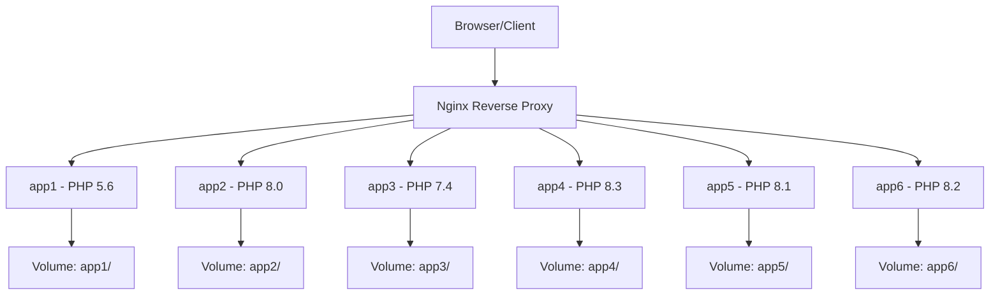

# Multi-PHP Development Environment

Environment pengembangan berbasis Docker yang memungkinkan menjalankan multiple aplikasi PHP dengan versi PHP yang berbeda secara bersamaan dalam satu sistem.

## 📋 Daftar Isi

- [Overview](#overview)
- [Arsitektur Sistem](#arsitektur-sistem)
- [Versi PHP yang Didukung](#versi-php-yang-didukung)
- [Persyaratan Sistem](#persyaratan-sistem)
- [Instalasi](#instalasi)
- [Penggunaan](#penggunaan)
- [Struktur Direktori](#struktur-direktori)
- [Konfigurasi](#konfigurasi)
- [Troubleshooting](#troubleshooting)
- [Kontribusi](#kontribusi)

## 🚀 Overview

Multi-PHP adalah environment pengembangan yang dirancang untuk mengatasi kebutuhan developer yang harus mengelola multiple aplikasi PHP dengan versi yang berbeda. Dengan menggunakan Docker dan Docker Compose, environment ini menyediakan:

- **Isolasi Versi PHP**: Setiap aplikasi berjalan dengan versi PHP yang spesifik
- **Reverse Proxy**: Nginx sebagai gateway untuk routing request
- **Automated Provisioning**: Script otomatis untuk setup aplikasi baru
- **Hot Reload**: Perubahan code langsung terlihat tanpa rebuild container

## 🏗️ Arsitektur Sistem



### Container Services

| Service | PHP Version | Container Name | Port Internal |
|---------|-------------|----------------|---------------|
| app1    | PHP 5.6     | app1          | 80            |
| app2    | PHP 8.0     | app2          | 80            |
| app3    | PHP 7.4     | app3          | 80            |
| app4    | PHP 8.3     | app4          | 80            |
| app5    | PHP 8.1     | app5          | 80            |
| app6    | PHP 8.2     | app6          | 80            |
| route   | Nginx       | route         | 80 → 80       |

## 🐘 Versi PHP yang Didukung

Environment ini mendukung versi PHP berikut:

- ✅ **PHP 5.6** (Legacy Support)
- ✅ **PHP 7.0** (Legacy Support)
- ✅ **PHP 7.1** (Legacy Support)
- ✅ **PHP 7.2** (Legacy Support)
- ✅ **PHP 7.3** (Legacy Support)
- ✅ **PHP 7.4** (Active)
- ✅ **PHP 8.0** (Active)
- ✅ **PHP 8.1** (Active)
- ✅ **PHP 8.2** (Active)
- ✅ **PHP 8.3** (Latest)

### Extensions yang Tersedia

Setiap versi PHP dilengkapi dengan extensions berikut:

- **imagick** - Image manipulation
- **curl** - HTTP client
- **gd** - Graphics library
- **mbstring** - Multi-byte string
- **mysql** - MySQL database
- **pgsql** - PostgreSQL database
- **bcmath** - Arbitrary precision mathematics
- **bz2** - Bzip2 compression
- **memcache** - Memory caching
- **xml** - XML processing
- **dom** - DOM manipulation
- **json** - JSON handling (PHP < 8.0)

## 💻 Persyaratan Sistem

### Minimum Requirements

- **Docker**: >= 20.10.0
- **Docker Compose**: >= 2.0.0
- **RAM**: 4GB (Recommended: 8GB)
- **Storage**: 10GB free space
- **OS**: Linux, macOS, Windows (dengan WSL2)

### Recommended System

- **CPU**: 4 cores atau lebih
- **RAM**: 8GB atau lebih
- **Storage**: SSD dengan 20GB free space

## 📦 Instalasi

### 1. Clone Repository

```bash
git clone <repository-url>
cd multi-php
```

### 2. Setup Permissions

```bash
chmod +x build.sh route.sh
```

### 3. Build dan Start Environment

```bash
# Setup routing container
./route.sh

# Start semua services
docker-compose up -d
```

### 4. Verifikasi Installation

```bash
# Check status containers
docker-compose ps

# Check logs
docker-compose logs
```

## 🎯 Penggunaan

### Menjalankan Environment

```bash
# Start semua services
docker-compose up -d

# Stop semua services
docker-compose down

# Restart specific service
docker-compose restart app1

# View logs
docker-compose logs -f app1
```

### Membuat Aplikasi Baru

#### Menggunakan Build Script

```bash
# Syntax: ./build.sh -n <nama_app> -v <versi_php> [-d <subdirectory>]

# Contoh: Aplikasi dengan PHP 8.3
./build.sh -n myapp -v 8.3

# Contoh: Aplikasi dengan PHP 7.4 dan subdirectory
./build.sh -n legacyapp -v 7.4 -d /public

# Contoh: Aplikasi dengan PHP 8.1
./build.sh -n apiservice -v 8.1
```

#### Manual Setup

1. **Buat direktori aplikasi**:
   ```bash
   mkdir app/myapp
   ```

2. **Buat konfigurasi Apache**:
   ```bash
   cp config/apache2/app1.conf config/apache2/myapp.conf
   ```

3. **Edit konfigurasi sesuai kebutuhan**

4. **Buat konfigurasi Nginx routing**:
   ```bash
   # File: config/route/myapp.conf
   server {
       listen 80;
       server_name myapp.local;
       
       location / {
           proxy_pass http://myapp:80;
           proxy_set_header Host $host;
           proxy_set_header X-Real-IP $remote_addr;
       }
   }
   ```

### Mengakses Aplikasi

#### Setup Local DNS

Tambahkan entries berikut ke file `/etc/hosts` (Linux/Mac) atau `C:\Windows\System32\drivers\etc\hosts` (Windows):

```
127.0.0.1 app1.local
127.0.0.1 app2.local
127.0.0.1 app3.local
127.0.0.1 app4.local
127.0.0.1 app5.local
127.0.0.1 app6.local
127.0.0.1 myapp.local
```

#### Browser Access

- **PHP 5.6 App**: http://app1.local
- **PHP 8.0 App**: http://app2.local
- **PHP 7.4 App**: http://app3.local
- **PHP 8.3 App**: http://app4.local
- **PHP 8.1 App**: http://app5.local
- **PHP 8.2 App**: http://app6.local
- **Custom App**: http://myapp.local

## 📁 Struktur Direktori

```
multi-php/
├── 📄 README.md                    # Dokumentasi ini
├── 📄 docker-compose.yml           # Orchestration file
├── 📄 build.sh                     # Script untuk membuat app baru
├── 📄 route.sh                     # Script setup routing
│
├── 📁 app/                         # Direktori aplikasi
│   ├── 📁 app1/                    # PHP 5.6 application
│   ├── 📁 app2/                    # PHP 8.0 application
│   ├── 📁 app3/                    # PHP 7.4 application
│   ├── 📁 app4/                    # PHP 8.3 application
│   ├── 📁 app5/                    # PHP 8.1 application
│   ├── 📁 app6/                    # PHP 8.2 application
│   └── 📁 hasil-pro3/              # Sample application
│
├── 📁 config/                      # Konfigurasi files
│   ├── 📁 apache2/                 # Apache virtual hosts
│   │   ├── app1.conf
│   │   ├── app2.conf
│   │   └── ...
│   ├── 📁 php5.6/                  # PHP 5.6 config
│   ├── 📁 php7.4/                  # PHP 7.4 config
│   ├── 📁 php8.0/                  # PHP 8.0 config
│   ├── 📁 php8.1/                  # PHP 8.1 config
│   ├── 📁 php8.2/                  # PHP 8.2 config
│   ├── 📁 php8.3/                  # PHP 8.3 config
│   └── 📁 route/                   # Nginx routing config
│
├── 📁 dockerfile/                  # Docker build files
│   ├── php-apache2.dockerfile      # PHP + Apache image
│   └── route.dockerfile            # Nginx routing image
│
└── 📁 log/                         # Log directories
    ├── 📁 app1/                    # App1 logs
    ├── 📁 app2/                    # App2 logs
    ├── 📁 route/                   # Nginx logs
    └── ...
```

## ⚙️ Konfigurasi

### PHP Configuration

Setiap versi PHP memiliki file `php.ini` terpisah di direktori `config/phpX.X/`:

```ini
# Contoh konfigurasi umum
memory_limit = 256M
upload_max_filesize = 100M
post_max_size = 100M
max_execution_time = 300
```

### Apache Virtual Host

Template konfigurasi Apache di `config/apache2/`:

```apache
<VirtualHost *:80>
    ServerAdmin admin@domain.com
    ServerName myapp.local
    DocumentRoot /var/www/html
    
    ErrorLog ${APACHE_LOG_DIR}/error.log
    CustomLog ${APACHE_LOG_DIR}/access.log combined
    
    <Directory "/var/www/html">
        AllowOverride All
        Options +ExecCGI -MultiViews +SymLinksIfOwnerMatch
        Order allow,deny
        Allow from all
        AddType application/x-httpd-php .php .html .htm
    </Directory>
</VirtualHost>
```

### Nginx Routing

Template konfigurasi Nginx di `config/route/`:

```nginx
server {
    listen 80;
    server_name myapp.local;
    
    proxy_connect_timeout 180;
    proxy_send_timeout 180;
    proxy_read_timeout 180;
    send_timeout 180;
    
    location / {
        proxy_pass http://myapp:80;
        proxy_buffering off;
        proxy_redirect off;
        proxy_set_header Host $host;
        proxy_set_header X-Real-IP $remote_addr;
        proxy_set_header X-Forwarded-For $proxy_add_x_forwarded_for;
        proxy_set_header Referer $http_referer;
    }
}
```

## 🔧 Troubleshooting

### Common Issues

#### 1. Port 80 Already in Use

```bash
# Check what's using port 80
sudo lsof -i :80

# Stop Apache/Nginx if running
sudo systemctl stop apache2
sudo systemctl stop nginx

# Or use different port
# Edit docker-compose.yml: "8080:80"
```

#### 2. Permission Denied

```bash
# Fix permissions
sudo chown -R $USER:$USER app/
chmod -R 755 app/
```

#### 3. Container Won't Start

```bash
# Check logs
docker-compose logs <service_name>

# Rebuild container
docker-compose build --no-cache <service_name>
docker-compose up -d <service_name>
```

#### 4. DNS Resolution Issues

```bash
# Flush DNS (Mac)
sudo dscacheutil -flushcache

# Flush DNS (Linux)
sudo systemctl restart systemd-resolved

# Check hosts file
cat /etc/hosts
```

### Debugging Commands

```bash
# Enter container shell
docker exec -it app1 /bin/bash

# Check PHP version
docker exec app1 php -v

# Check Apache status
docker exec app1 service apache2 status

# Check Nginx config
docker exec route nginx -t

# View real-time logs
docker-compose logs -f
```

### Performance Optimization

#### 1. Resource Limits

Edit `docker-compose.yml`:

```yaml
services:
  app1:
    # ... other config
    deploy:
      resources:
        limits:
          memory: 512M
          cpus: '0.5'
```

#### 2. PHP-FPM Optimization

Edit `config/phpX.X/php.ini`:

```ini
# Memory
memory_limit = 512M

# OPcache
opcache.enable=1
opcache.memory_consumption=256
opcache.max_accelerated_files=20000

# Realpath Cache
realpath_cache_size=4096K
realpath_cache_ttl=600
```

## 🤝 Kontribusi

### Development Workflow

1. **Fork repository**
2. **Create feature branch**:
   ```bash
   git checkout -b feature/new-php-version
   ```
3. **Make changes**
4. **Test thoroughly**
5. **Submit pull request**

### Adding New PHP Version

1. **Create config directory**:
   ```bash
   mkdir config/php8.4
   cp config/php8.3/php.ini config/php8.4/php.ini
   ```

2. **Add service to docker-compose.yml**:
   ```yaml
   app7:
     build:
       context: .
       dockerfile: ./dockerfile/php-apache2.dockerfile
       args:
         - php_version=8.4
         - app_name=app7
     # ... rest of config
   ```

3. **Test new version**:
   ```bash
   ./build.sh -n testapp -v 8.4
   ```

### Reporting Issues

Saat melaporkan issue, sertakan:

- **OS dan versi Docker**
- **Error messages lengkap**
- **Steps to reproduce**
- **Expected vs actual behavior**

## 📝 Changelog

### v2.0.0 (Latest)
- ✅ Added PHP 8.1, 8.2, 8.3 support
- ✅ Improved documentation
- ✅ Enhanced build script
- ✅ Better error handling

### v1.0.0
- ✅ Initial release
- ✅ PHP 5.6, 7.4, 8.0 support
- ✅ Basic Docker Compose setup
- ✅ Nginx reverse proxy

## 📄 License

MIT License - see [LICENSE](LICENSE) file for details.

## 🙏 Acknowledgments

- **Docker Community** untuk containerization tools
- **PHP Community** untuk continuous development
- **Nginx Team** untuk high-performance web server
- **Apache Foundation** untuk web server technology

---

**Happy Coding! 🚀**

Jika ada pertanyaan atau butuh bantuan, jangan ragu untuk membuat issue atau menghubungi maintainer.
